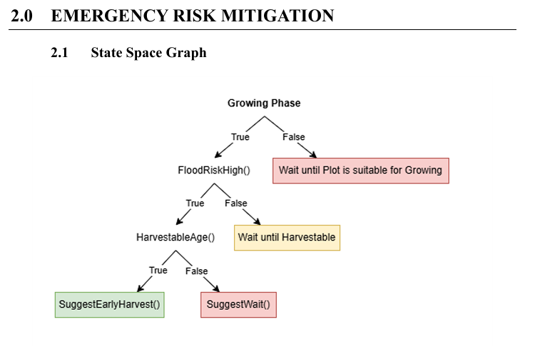

# Phase 3: State Space Search for Pathfinding & Decision Tree Optimization 🌾🤖

## 1. Project Summary
As part of my academic coursework in **Artificial Intelligence (SECJ3553)**, our team engineered a structured **State Space Search Framework** to map out and optimize agricultural operations. The core operational problem addressed in this phase was the lack of sequential step-by-step pathfinding logic when evaluating competing farming actions. Without formalizing field operations into clear nodes, state transitions, and path costs, a predictive system cannot determine whether it is more efficient to apply immediate irrigation, deploy protection assets, or wait for environmental shifts, leading to chaotic and unoptimized field management.

To establish clear, mathematical pathfinding boundaries, our system breaks agricultural workflows into two core search mechanics:
* **The Planting Phase Tree:** Models sequential logic checking conditions one by one, moving from PlotEmpty through moisture checks (HumidityOptimal) and weather warnings (FloodRiskHigh). This structural path maps out exact choices to reach terminal states like Suggest PlantNow(), SuggestWait(), or Suggest Early Harvest().
* **The Crop Maintenance Monitoring Lifecycle:** Formulates continuous monitoring cycles checking Water Level $\rightarrow$ Nutrient Level $\rightarrow$ Sunlight Level to confirm steady growth. Each abnormal deviation (e.g., low nutrients or high sunlight) requires a corrective action and loops back to a new evaluation cycle, adding an incremental step to the path cost until the target goal state—Healthy Growth—is reached with minimal cost. 

---

## 2. System Evidence & Implementation

### Staet Space Search Diagram for Emergency Risk Migitation

*Figure 2: Formatted State Space Graph detailing emergency risk mitigation transitions based on real-time climate inputs.*

**Explanation:** The decision-making architecture boots directly into the initial PlotEmpty node to confirm land readiness before moving forward. Once active, the search engine evaluates soil moisture dynamics at the HumidityOptimal() decision gate, routing the process down to a wait directive if the ground is too dry to support seeds. If moisture thresholds are met, the path evaluates the critical FloodRiskHigh() conditions where real-time meteorological API streams are constantly checked. When incoming payloads flag an imminent storm or regional flash flood, the search engine immediately overrides normal operational sequences, charting the shortest path to an emergency branch that outputs a directive to harvest early, safeguarding volumetric yield value before catastrophic asset loss occurs.

---

## 3. Personal Reflection

**Key Takeaways**

* **Mathematical Modeling of Real-World Workflows:** Completing this phase showed me how to break down an unpredictable, messy farming environment into a clean mathematical search graph. I learned that abstract concepts like pathfinding and search trees are not just for basic games or mazes, but are essential structural frameworks needed to schedule complex real-world choices such as mapping land availability, soil variables, and critical weather constraints.

* **Quantifying Operational Costs:** I learned how to formulate abstract system delays and corrective actions into concrete, measurable path costs. Structuring the crop maintenance loops taught me that every operational issue—such as low soil nutrients or excessive heat—contributes directly to a higher path cost, proving that an optimal system path is achieved only when environmental parameters remain stable and balanced.

* **Dynamic Emergency Interception:** This assignment highlighted the necessity of building flexible branching paths to manage high-stakes environmental changes. I learned that a smart backend system must be able to immediately catch hazardous climate data anomalies (like high flood risks) and override standard loops to instantly calculate the lowest-cost path toward protective emergency strategies.
