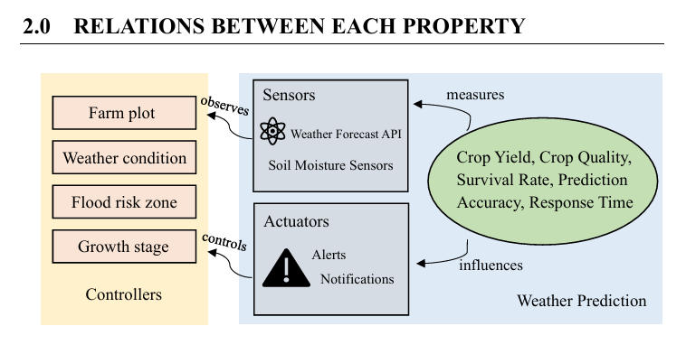

# Phase 4: Intelligent Agent Design — PEAS Framework & Closed Loop Architecture 🌾🤖

## 1. Project Summary
As part of my academic coursework in **Artificial Intelligence (SECJ3553)**, our team engineered an abstract architectural plan for an **Intelligent Agent** tailored to automated agricultural control. The core structural problem addressed in this phase was the lack of a standardized, reactive feedback loop between local environmental variables and software actuators. Without a formalized agent design, a system cannot determine how to balance raw sensor inputs with intelligent behavioral decisions, which results in disjointed automation, uncoordinated push notifications, and rigid prescriptive advice that fails to adapt to real-world responses.

To construct a cohesive, self-improving platform layout, our system maps environmental processes using a comprehensive tracking approach:
* **The PEAS Formulation Matrix:** Establishes clear technical boundaries across Performance measures ($P$), Environments ($E$), Actuators ($A$), and Sensors ($S$). This classification provides the agent with a transparent map of what success means (e.g., maximizing volumetric crop survival rates) and how it perceives external changes (e.g., real-time weather and flood forecasting APIs).
* **Closed-Loop Feedback Cycles:** Integrates dynamic real-time checking boundaries where user-submitted harvesting volumes continually refine internal data metrics. If actual crop health results fluctuate away from estimated baselines, the core predictive model adjusts automatically, changing downstream scheduling parameters to protect smallholder revenue streams.
---

## 2. System Evidence & Implementation

### Intelligent Agent System Boundary and Environmental Feedback Loop

*Figure 1: Architectural diagram detailing the intelligent agent system boundary and its environmental feedback loop.*

**🔍 Core Structural Component Breakdown** 
* **Environment Boundaries:** Encompasses active farm plots, shifting regional weather horizons, crop development cycles, and active flood risk coordinates.

* **Sensor Array Inputs:** Streams localized environmental metrics down-funnel using IoT soil moisture probes, automated crop lifecycle age calculators, and third-party macro-climate/flood warning API feeds.

* **Core Agent Brain Logic:** Processes raw sensor inputs to build an internal state representation, calculating optimal field paths while running proactive real-time checking rules.

* **Actuator Delivery Mechanisms:** Pushes strategic commands out to the field via automated dashboard notifications, predictive yield forecast curves, and interactive harvest timing recommendations.

* **Closed-Loop Learning Feedback:** Ingests actual manual yield results reported by farmers to continuously retrain the background analytical engine, improving prediction accuracy and minimizing variance across subsequent agricultural seasons.

---

## 3. Personal Reflection

**Key Takeaways**

* **Systematic Modular Abstraction:** Completing this phase showed me how to break down an autonomous software architecture using the formal PEAS model. I learned that mapping out exactly how an agent perceives its environment through sensors and manipulates conditions through actuators is a crucial step before constructing physical automation code.
  
* **Dynamic Feedback and Adaptation:** I gained deep insights into how a closed-loop system uses real-world data to improve its own performance. Learning to route manual farmer yield feedback back into the predictive model proved that an effective AI system must continuously retrain its parameters to account for environmental fluctuations.

* **Context-Aware Decision Prioritization:** This assignment demonstrated how an intelligent agent balances competing goals based on short-term risks versus long-term rewards. I learned that by combining real-time API monitoring with logical rules, the system can make smart adjustments—like delaying irrigation if heavy rain is expected within 24 hours to prevent resource waste.
