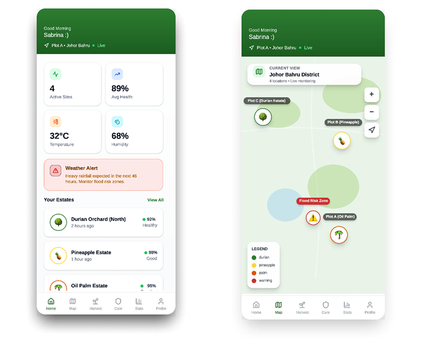
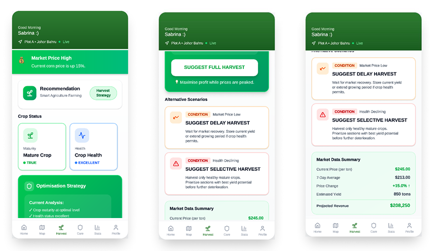

# Phase 5: Proof of Concept & Scenarios — User Interface Validation & Dynamic Execution 🌾🤖

## 1. Project Summary
As part of my academic coursework in **Artificial Intelligence (SECJ3553)**, our team developed a high-fidelity **Proof of Concept Simulation Platform** to visually demonstrate and validate how the underlying intelligent agent performs in real-world scenarios. The core challenge addressed in this phase was ensuring that complex, algorithmic data insights—such as multi-variable state spaces, production logic rules, and real-time environmental data streams—could be translated into simple, actionable visual views for non-technical users. Without a practical user interface layout, critical alert directives remain hidden within system logs, rendering the automated platform unusable for farmers making high-stakes choices under severe time constraints.

To bridge this operational interface gap, our proof of concept demonstrates the platform's utility across live situational evaluations:
* **The High-Alert Risk Vector:** Simulates immediate weather alert triggers and localized risk mappings, visualizing exactly how the system behaves when sudden flash floods threaten unharvested assets.
* **The Structural Harvest Decision Optimization:** Models comparative yield prediction curves and timeline metrics to help users mathematically evaluate whether to push for an immediate harvest or hold out for peak crop maturity.

---

## 2. System Evidence & Implementation

To validate the operational performance of our underlying AI model, the following user interface components illustrate the agent's real-time communication strategy when resolving high-risk climate factors.

### 🚨 Scenario 1: Critical Flood Risk Management

*Figure 1: UI dashboard displaying critical climate tracking flags and localized weather threat indicators.*

**Explanation:** The system interface automatically surfaces high-priority warnings by executing core production reasoning rules directly against active regional weather feeds. When incoming data packets flag severe localized downpours within a 48-hour window, the dashboard immediately overrides standard layouts to display a bold, clear weather alert component and a geographic tracking view highlighting threatened estate boundaries. This automated response converts complex risk probability numbers into a clear, visual warning message, ensuring that field managers can instantly see regional flood zone parameters and mobilize emergency mitigation teams without delay.

### 🌾 Scenario 2: Harvest Optimisation Strategy

*Figure 2: UI view displaying yield metrics, crop maturity ratings, and prescriptive operational advice.*

**Explanation:** The platform handles scheduling dilemmas by using a dedicated harvest optimization interface to evaluate structural growth stages against expected financial values. In this scenario, the AI brain detects that while standing crops have reached a baseline maturity level, waiting an additional five days will maximize volumetric yield values and optimize product quality indicators. The system displays this analytical tradeoff using clean crop health bars, explicit maturity percentages, and a clear directive recommending a delayed harvesting strategy, replacing traditional manual guesswork with explicit, data-driven advice.

---

## 3. Personal Reflection

**Key Takeaway:** 

* **Translating Algorithm Logic into Usable Interfaces:** This final phase showed me that a powerful AI model is only useful if non-technical operators can easily understand its outputs. I learned how to abstract complex first-order predicate logic and real-time backend API data packets into simple, high-visibility dashboard alerts that help users make fast decisions under pressure.
* **Context-Driven System Overrides:** I gained an understanding of how automated platforms use conditional logic to prioritize high-stakes emergencies over regular business metrics. Seeing how the system automatically drops standard telemetry displays to flash an urgent weather warning during a flood simulation proved how intelligent software can guide field behavior.
* **Validating Analytical Tradeoffs Visually:** Building the harvest optimization screens taught me how to present data-driven options clearly to users. I realized that by cleanly showing estimated growth timelines alongside quality indicators, an AI system can successfully prove the value of its recommendations, changing how users trust data over traditional manual guessing.

---
